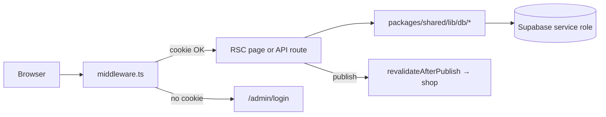

# Admin app architecture (`apps/admin`)

Staff console for Buy n Try. One Next.js app, one Supabase project, shared UI/data in `packages/shared`. Optimized for **few round-trips**, **small list payloads**, and **predictable routing**.

Related: [BACKEND_ARCHITECTURE.md](./BACKEND_ARCHITECTURE.md) (deploy, caching tags, observability).

## Request flow



| Step | File | Behavior |
|------|------|----------|
| Gate | `apps/admin/middleware.ts` | Cookie must match `ADMIN_TOKEN` for `/admin/*` (except public) and protected `/api/*` |
| UI shell | `app/admin/layout.tsx` | `AdminShell` nav + lazy command palette |
| Data | `@/lib/db/admin-store` etc. | Server-only; resolves to `packages/shared` |
| Client edits | `adminFetch()` in shared components | JSON to `/api/admin/*` on same host |

**Public paths (no cookie):** `packages/shared/lib/admin-public-paths.ts`, `admin-api-public-paths.ts` (login, forgot-password, webhooks).

## Routing map

### UI pages (`app/admin/**/page.tsx`)

| Path | Role | Data pattern |
|------|------|----------------|
| `/admin` | Dashboard | `fetchAdminDashboardCatalogMetrics`, order RPC — no full product table |
| `/admin/products` | Product list | Paginated / lite selects via API or server list |
| `/admin/products/new`, `/admin/products/[id]` | Editor | `getAdminProduct` (full embed) |
| `/admin/categories`, `/admin/collections` | Merchandising | Shop types cache + CRUD APIs |
| `/admin/orders`, `/admin/orders/[orderId]` | Orders | `admin-orders-store` pagination |
| `/admin/customers`, `/admin/customers/[key]` | CRM rollups | View + pagination |
| `/admin/deals` | Bundle deals | Client `DealsManager` → `GET /api/admin/deals` |
| `/admin/blog`, `/admin/pages` | Content index | `listAdminPagesIndex` (no `sections` JSON) |
| `/admin/blog/[id]`, `/admin/pages/[id]` | Content editor | `PageForm` + `/api/admin/pages/[id]` |
| `/admin/settings`, `/admin/hero`, `/admin/homepage-sections` | Site config | Settings cache + tag invalidation |
| `/admin/broadcast`, `/admin/inbox`, `/admin/messaging` | Comms | Heavy UI often `dynamic()` |
| `/admin/login`, `/admin/forgot-password` | Auth | Public |

All admin pages: `robots: noindex`, most `dynamic = "force-dynamic"` where data must be fresh.

### API routes (`app/api/**`)

**Admin CRUD** — prefix `/api/admin/` — auth via `isAdminRequest(request)` + middleware cookie.

| Group | Examples | Store module |
|-------|----------|--------------|
| Catalog | `products`, `categories`, `collections`, `deals` | `admin-store`, `deal-store`, `collection-store` |
| Content | `pages`, `homepage-sections`, `hero`, `testimonials` | `admin-store` |
| Commerce | `orders`, `promos`, `discounts`, `reviews` | `admin-orders-store`, `admin-store` |
| Config | `settings`, `lifestyle-shop`, `invoice-template` | `admin-store` (cached reads) |
| Media | `upload` | Supabase storage |
| Auth | `login`, `logout`, `forgot-password`, `update-password` | Cookie + token |
| Search | `search`, `quick-action` | Bounded `ilike` queries |

**Other protected APIs** (same middleware):

- `/api/messaging/*` — SMS campaigns
- `/api/orders/[orderId]/*` — legacy/alternate order hooks
- `/api/indexnow` — SEO ping
- `/api/webhooks/resend` — public webhook (listed in api-public-paths)

Every handler should use `withAdminApiObservability("METHOD /path", handler)` (see BACKEND_ARCHITECTURE).

## Layering rules (keep it simple)

1. **Page (RSC)** — read-only lists and dashboard; call store functions directly.
2. **Route handler** — mutations and client-driven screens; validate with `isAdminRequest`, delegate to store, return JSON.
3. **Store (`packages/shared/lib/db`)** — SQL shape, business rules, cache tags, storefront revalidation.
4. **Client components (`packages/shared/components/admin`)** — forms, tables, `adminFetch`; no service role in browser.

Do **not** duplicate business logic in API routes; do **not** load `select("*")` on large tables for index screens.

## Performance conventions (implemented)

| Area | Before | After |
|------|--------|--------|
| Product slug check | Load all `id, slug` on every save/publish | `isProductSlugTaken(slug, exceptId?)` — one row |
| Product category counts cache | Stale after CRUD | `bumpAdminProductsCache()` on product create/save/publish/unpublish/discard/delete |
| Blog/pages admin list | `listAdminPages()` + full row | `listAdminPagesIndex({ pageType? })` — metadata columns only |
| Deals `GET` | Full catalog + images + 2500 orders via `loadOrderBundle` | `fetchDealCatalogBasics()` + `listDeliveredOrdersForDealSuggestions()` (1000 cap, sync map) |
| Dashboard | Full product list | Dedicated metrics queries + dashboard select |
| Shell JS | Eager command palette | `dynamic()` import in `admin-shell` |
| CSS/fonts | Storefront theme + dual fonts | Trimmed `globals.css`, Manrope only (`admin-fonts.ts`) |

## Caching tags

### Admin app (`unstable_cache` on admin host)

| Tag | Used for | Invalidate on |
|-----|----------|----------------|
| `admin-settings` | Settings reads | Settings writes |
| `admin-shop-types` | Categories list | Category CRUD |
| `admin-products` | Category product counts | Product CRUD, shop type bump |

### Shop app (storefront data — bust from admin via `/api/revalidate`)

All merchandising writes should call **`revalidateShopMerchandising(...paths)`** once. That POSTs shop paths **and** these tags in a **single** request when `STOREFRONT_URL` is set:

| Tag | Data |
|-----|------|
| `storefront-shop-types` | Category names, slugs, **cover images**, active flag |
| `storefront-homepage-catalog` | Homepage product pool |
| `storefront-home-slots` | Bestsellers / featured / offers rails |
| `storefront-catalog-grid` | PLP grids, category pages, related products |
| `storefront-extra-rails` | Extra collection carousels |
| `storefront-site-settings` | Layout, home sections, featured override |
| `storefront-hero-slides` | Hero carousel |
| `storefront-testimonials` | Reviews strip |

**Required env on voltgear-admin:** `STOREFRONT_URL=https://buyntryy.com` (same `ADMIN_TOKEN` as shop revalidate bearer). Without it, admin only revalidates its own host — **shoppers can stay stale up to ISR TTL (~5 min).**

Observability: search Vercel logs for `[storefront-revalidate]` after saves.

## Duplicate code note

The repo root still contains legacy `app/admin` and `lib/db/admin-store.ts` for an older single-app layout. **Production admin is `apps/admin`**, which imports `packages/shared`. Prefer changing shared store once; avoid editing root duplicates unless you still deploy from monorepo root.

## Adding a feature (checklist)

1. Store function in `packages/shared/lib/db/` with minimal `select(...)`.
2. API route under `apps/admin/app/api/admin/...` + observability wrapper.
3. Page or client component; use index/lite queries for lists.
4. On publish: `revalidateAfterPublish` + relevant cache tag bump.
5. Run `node scripts/wrap-admin-api-observability.mjs` if you added routes.
6. `npm run build:admin` before merge.

## Cold start mitigation

- **`GET /api/admin/warm`** — requires `Authorization: Bearer CRON_SECRET` (same secret as shop `/api/flows`).
- **`apps/admin/vercel.json`** cron: daily `0 7 * * *` UTC (Hobby: once/day; on Pro you can tighten the schedule in the dashboard).
- Set **`CRON_SECRET`** on the **voltgear-admin** Vercel project (same value as shop is fine).

Staff should use the **admin host directly** when possible (avoid shop → admin proxy double hop).

## Verification

```bash
npm run build:admin
npm test -- --testPathPattern=dashboard-rules
```

Smoke (with env): `ADMIN_SAME_ORIGIN=1 npm run smoke:t40`
